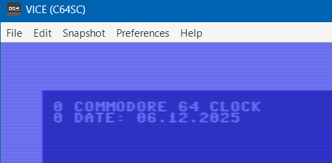

# RetroC64 Demo
This is just a simple starter app to test out RetroC64 library, which is available on Nuget.
C64 is the Commmodore 64 home computer from the 80's, an early 8-bit computer for programming, gaming, hobby use and
fun stuff.

## RetroC64
More info is available at the RetroC64 website here:

https://github.com/RetroC64/RetroC64

## Commodore C64 Emulator - VICE
You will find C64 Emulator called VICE here:
https://github.com/VICE-Team/svn-mirror/releases

The releases contains fresh Windows 64 Binaries for example.
Check the file launchSettings.json in this repo, where the environment variable `RETROC64\_VICE\_BIN` is set. 

Adjust the path to where you installed VICE.

## Screenshot of the running DEMO
Just run the DEMO after you have set up VICE and adjusted the environment variable and you should see something like this.
A simple screen with current time.



Note that C64 screen is 320x200 pixels with 16 colors and a character set of 256 characters (8x8 pixels each).
Letters must be in upper case and there are some special characters available as well to for example clear the screen
or change foreground color.

RetroC64 allows you to utilize high-level code in C# too, but you must remember the limitations of the C64 hardware.
In addition, to dynamically execute code, you must stick to the BASIC programming language. Each line must be numbered at the start. 

This method allows you to prefix the BASIC code with numbers automatically. For GOTOs you must however think about the line numbers yourself.
GOTOs are considered EVIL and bad programming practice, but on C64 they are often the only way to do loops and branches.

```csharp 

  private string ToBASICString(string input) =>
        string.Join(Environment.NewLine, input.Split(Environment.NewLine).Select((x, i) => ((i * 10) + 10) + " " + x));

```


